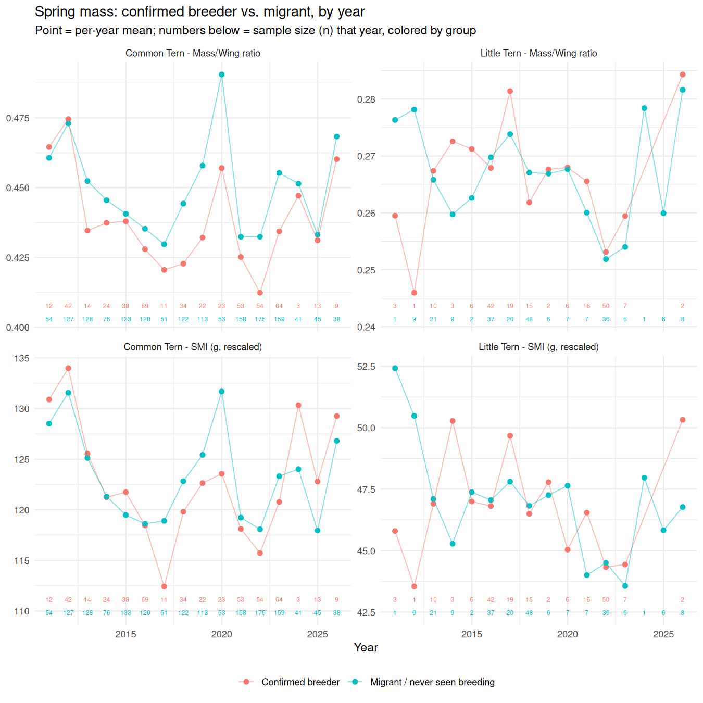
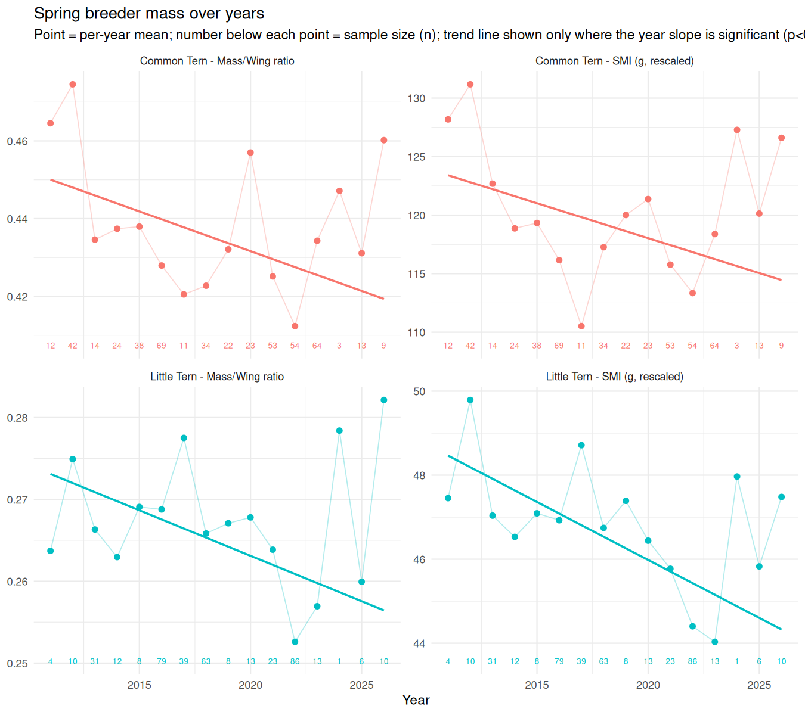
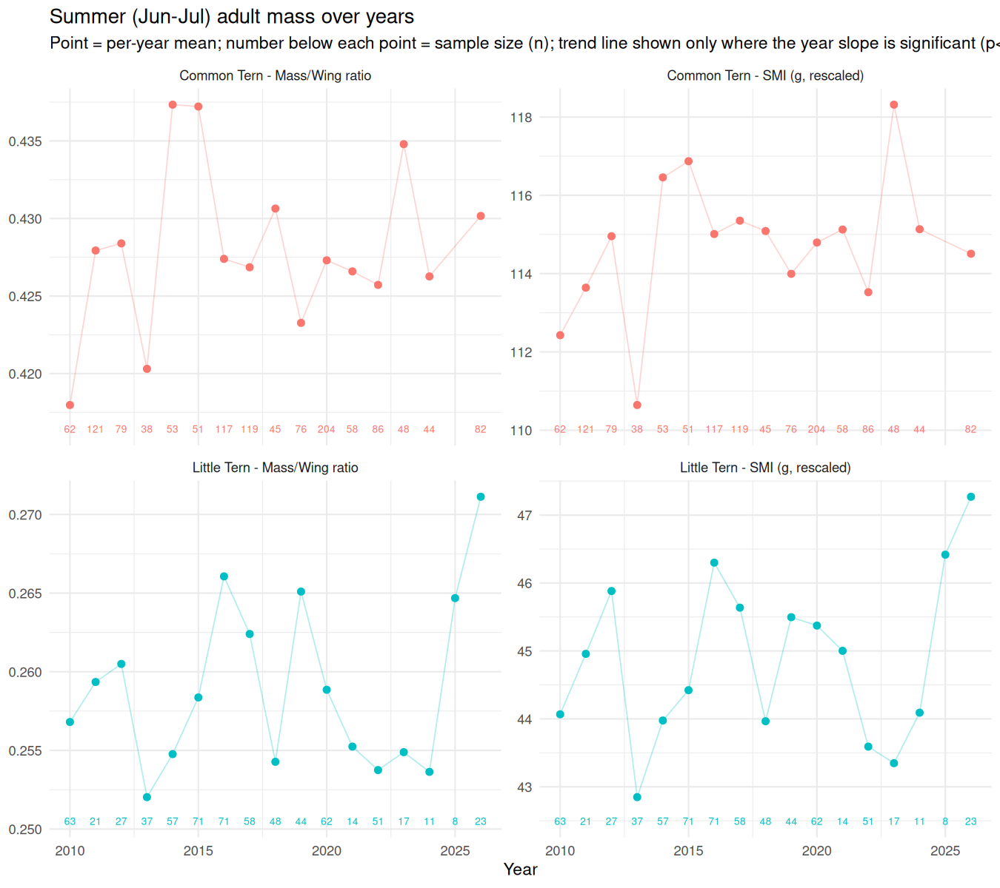
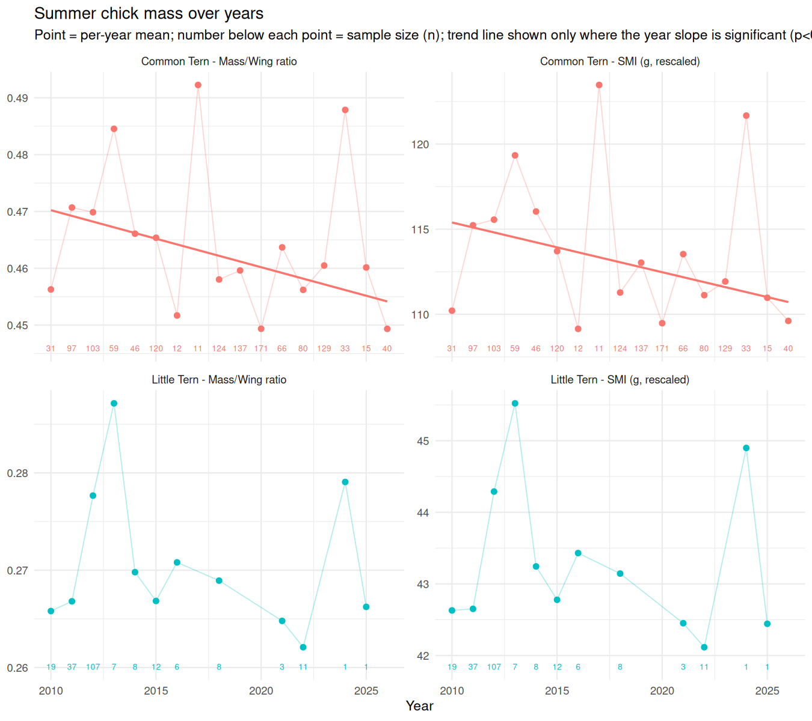

# Tern mass: summary across issues #5-#10

Consolidates every mass-related result in the repo (issues #5, #6, #7, #8,
#9, #10) into one place. Full reproducible code, all tables, and every
test in this document live in `scripts/10_mass_decline_summary.Rmd`
(renders to `output/10_mass_decline_summary.html`); this file is the
narrative summary of that script plus a couple of issue-specific figures
carried over unchanged (noted where used).

**Only wing-normalized mass is used throughout** - simple ratio
(`Weight/Wing`) and SMI (scaled mass index, Peig & Green 2009). Raw mass
is not shown anywhere below, even where it was the original headline
metric, because it conflates body condition with body size. Every plot
below is followed by its sample-size table and its significance-test
table, and every trend section includes a test of whether the most
recent year differs from what the historical trend would predict.

## Bottom lines

1. **Breeders vs. migrants (spring): real for Common Tern under one
   metric, not the other; absent for Little Tern.** Common Tern
   confirmed breeders are significantly lighter (relative to wing) than
   migrants under the simple ratio (p=2.1e-11), but that difference
   **is not significant once SMI's fuller size-correction is applied**
   (p=0.06-0.17) - because Common Tern breeders also have measurably
   shorter wings than migrants (a real, separate finding - see
   "Additional findings" below). Little Tern shows no breeder/migrant
   mass difference under either metric.
2. **Spring breeding-population mass is declining significantly, in
   both species, under both normalized metrics.** Common Tern breeders:
   SMI -0.60 g/year (p=2e-05). Little Tern (no meaningful breeder split
   exists, so all spring adults are used): SMI -0.28 g/year (p=2e-05).
3. **Summer (Jun-Jul) adult mass shows no significant trend over years,
   in either species, under either metric** (all four p between 0.10 and
   0.45) - flat/noisy, not declining.
4. **Within the season, mass changes - direction depends on species -
   but that pattern isn't itself shifting in recent years.** Common Tern
   mass rises across Jun-Jul in most years (13 of 16 under normalization,
   only 3 of 16 show a decrease); Little Tern falls in most years, though
   closer to even once normalized (9-10 of 17). Neither species' latest
   year, nor its last 3 years, differs significantly from the historical
   spread of within-season patterns (all p > 0.09).
5. **Chick mass is declining significantly - Common Tern only.** SMI
   -0.29 g/year (p=0.0002), ratio p=0.0005. Little Tern chicks show no
   trend under either metric (p=0.30-0.38) - and have almost no recent
   data to test in the first place (see the chick section).

---

## 1. Spring: breeders vs. migrants

**Population**: spring-caught (Mar-May) adults. "Confirmed breeder" =
that ring was also recorded in the colony in June/July of *any* year
(issue #5 task 2c's definition - the closest available evidence of
being a colony-associated breeder rather than a passage migrant).
"Migrant / never seen breeding" = spring adults never once recorded in
June/July.

**Methodological note**: unlike the trend sections below, SMI here is
computed with **one pooled reference (SMA slope + mean wing length) per
species, shared by both groups** - not each group rescaled to its own
mean wing length. This matters because if the two groups differ in body
size (wing length), rescaling each to its own mean would partly
reintroduce that size difference into the "condition" metric. They
do differ, for Common Tern - see below.



### Sample size

| Species | Group | n |
|---|---|---|
| Common Tern | Confirmed breeder | 485 |
| Common Tern | Migrant / never seen breeding | 1593 |
| Little Tern | Confirmed breeder | 182 |
| Little Tern | Migrant / never seen breeding | 224 |

Per-year breakdown is in the full report (`10_mass_decline_summary.html`,
Section 1) - coverage is thin for Little Tern in several years (e.g. 0-3
records/group before ~2016).

### Significance test

| Species | Metric | Breeder mean | Migrant mean | Pooled t-test p | Year-controlled p |
|---|---|---|---|---|---|
| Common Tern | Mass/Wing ratio | 0.435 | 0.448 | **2.14e-11** | **1.6e-11** |
| Common Tern | SMI (g) | 121.45 | 122.74 | 0.059 | 0.171 |
| Little Tern | Mass/Wing ratio | 0.264 | 0.266 | 0.562 | 0.735 |
| Little Tern | SMI (g) | 46.31 | 46.56 | 0.595 | 0.675 |

**Why ratio and SMI disagree for Common Tern**: breeders have
significantly shorter wings than migrants (272.9mm vs. 274.9mm, ~2mm,
t-test p=1.9e-08). The simple ratio doesn't fully correct for this;
SMI's SMA-based correction does, and once it's applied the breeder/
migrant mass gap shrinks to non-significance. This doesn't mean there's
*no* difference - it means the raw/ratio-based "breeders are lighter"
story is at least partly a body-size story, not purely a condition
story, and the two metrics should be reported together, not one alone.

### Is the last year's gap different from the historical gap?

| Species | Metric | Interaction p (2026 vs. other years) |
|---|---|---|
| Common Tern | Mass/Wing ratio | 0.732 |
| Common Tern | SMI (g) | 0.447 |
| Little Tern | Mass/Wing ratio | 0.833 |
| Little Tern | SMI (g) | 0.293 |

No - 2026's breeder/migrant gap (small as it is, n=9 CT breeders / 2 LT
breeders that year) is not statistically distinguishable from other
years' gap, for either species/metric.

---

## 2. Spring: breeder mass over years

**Population**: Common Tern = confirmed breeders (as above). Little Tern
has no meaningful breeder/non-breeder split (issue #5 task 2, and
Section 1 above, both found no mass difference), so **all spring adults**
are used as the closest available breeding-population proxy. SMI here is
fit **per species on its own data**, the standard convention for
tracking one group's condition over time (different from Section 1's
pooled reference).



### Significance test

| Species | Metric | n | Slope/year | p |
|---|---|---|---|---|
| Common Tern | Mass/Wing ratio | 485 | -0.0020 | **5.3e-07** |
| Common Tern | SMI (g) | 485 | -0.597 | **2.1e-05** |
| Little Tern | Mass/Wing ratio | 406 | -0.0011 | **2.7e-04** |
| Little Tern | SMI (g) | 406 | -0.276 | **2.1e-05** |

Both species decline significantly, under both metrics.

### Is the last year different from the historical trend?

| Species | Metric | n (2026) | 2026 mean | Trend-predicted | Deviation | p |
|---|---|---|---|---|---|---|
| Common Tern | Mass/Wing ratio | 9 | 0.460 | 0.416 | +0.045 | **2.8e-04** |
| Common Tern | SMI (g) | 9 | 126.6 | 113.3 | +13.3 | **1.8e-03** |
| Little Tern | Mass/Wing ratio | 10 | 0.282 | 0.252 | +0.030 | **2.5e-05** |
| Little Tern | SMI (g) | 10 | 47.5 | 43.8 | +3.7 | **1.5e-02** |

**Notable**: despite the significant long-term decline, 2026 sits
significantly *above* the trend line for both species and both metrics -
a real uptick against the historical decline, though on a small sample
(n=9-10). Worth flagging to Yosef rather than reading the decline as
monotonic through the most recent year.

---

## 3. Summer: adult mass over years

**Population**: adults captured directly in the colony during summer
(Jun-Jul, new ringings + recaptures) - by construction all breeders,
so no breeder/non-breeder split needed (issue #8's population).



### Significance test

| Species | Metric | n | Slope/year | p |
|---|---|---|---|---|
| Common Tern | Mass/Wing ratio | 1283 | +0.0002 | 0.452 |
| Common Tern | SMI (g) | 1283 | +0.089 | 0.186 |
| Little Tern | Mass/Wing ratio | 683 | +0.0002 | 0.194 |
| Little Tern | SMI (g) | 683 | +0.066 | 0.103 |

No significant trend, either species, either metric - flat/noisy year to
year (see the plot's per-year swings), not a real decline.

### Is the last year different from the historical trend?

| Species | Metric | n (2026) | 2026 mean | Trend-predicted | Deviation | p |
|---|---|---|---|---|---|---|
| Common Tern | Mass/Wing ratio | 82 | 0.430 | 0.428 | +0.002 | 0.697 |
| Common Tern | SMI (g) | 82 | 114.5 | 115.8 | -1.3 | 0.353 |
| Little Tern | Mass/Wing ratio | 23 | 0.271 | 0.259 | +0.012 | **7.9e-03** |
| Little Tern | SMI (g) | 23 | 47.3 | 44.9 | +2.3 | **2.3e-02** |

**Notable**: Common Tern's 2026 summer mass is unremarkable (right on
trend). **Little Tern's 2026 summer mass is significantly above trend,
under both metrics** - even though the overall multi-year trend is flat,
2026 itself stands out as a good year on this metric (n=23).

---

## 4. Within-season trajectory (Jun-Jul)

**Population and method**: identical to issue #10 (Jun-Jul window only -
August can include passage migrants as well as local breeders, so it's
excluded here; full Jun-Aug detail is in issue #10 directly).


### Does mass change within the season, in general?

| Species | Metric | n | Slope/day | p |
|---|---|---|---|---|
| Common Tern | Mass/Wing ratio | 1283 | +0.0004 | **2.6e-07** |
| Common Tern | SMI (g) | 1283 | +0.150 | **9.5e-10** |
| Little Tern | Mass/Wing ratio | 683 | -0.0001 | 0.237 |
| Little Tern | SMI (g) | 683 | -0.0083 | 0.613 |

Common Tern mass rises significantly across Jun-Jul (holds and even
strengthens under normalization vs. raw mass). Little Tern shows no
significant within-season trend under either metric.

### Per-year pattern and the "4 years of decrease" question

Common Tern's within-season slope is **positive in 13 of 16 years**
(both normalized metrics), negative in the other 3. Little Tern's is
majority-negative but close to even once normalized (10/17 ratio, 9/17
SMI). Neither species shows a significant `day_of_season x year`
interaction under normalization (Common Tern ratio p=0.115, SMI p=0.180;
Little Tern ratio p=0.730, SMI p=0.892) - the year-to-year variation in
slope isn't itself statistically distinguishable from noise, for either
species, once wing length is accounted for.

### Is the last year (or last few years) different from the rest?

| Comparison | Metric | p |
|---|---|---|
| Common Tern: 2026 vs. rest | Ratio | 0.368 |
| Common Tern: 2026 vs. rest | SMI | 0.693 |
| Common Tern: last 3 yrs vs. rest | Ratio | 0.313 |
| Common Tern: last 3 yrs vs. rest | SMI | 0.965 |
| Little Tern: 2026 vs. rest | Ratio | 0.394 |
| Little Tern: 2026 vs. rest | SMI | 0.429 |
| Little Tern: last 3 yrs vs. rest | Ratio | 0.109 |
| Little Tern: last 3 yrs vs. rest | SMI | 0.099 |

No significant difference for either species, under either metric, under
either definition of "recent" (all p > 0.09).

---

## 5. Chicks: mass over years

**Population**: this-year juveniles (age 3), Jun-Aug, new ringings +
recaptures (issue #9's population).



### Significance test

| Species | Metric | n | Slope/year | p |
|---|---|---|---|---|
| Common Tern | Mass/Wing ratio | 1274 | -0.0010 | **4.8e-04** |
| Common Tern | SMI (g) | 1274 | -0.292 | **2.0e-04** |
| Little Tern | Mass/Wing ratio | 220 | -0.0006 | 0.297 |
| Little Tern | SMI (g) | 220 | -0.080 | 0.379 |

Significant decline for Common Tern under both metrics. **No significant
trend for Little Tern under either metric** - see the caveat below on
why that's not very informative either way.

### Is the last year different from the historical trend?

| Species | Metric | Latest year | n | Deviation | p |
|---|---|---|---|---|---|
| Common Tern | Mass/Wing ratio | 2026 | 40 | -0.006 | 0.461 |
| Common Tern | SMI (g) | 2026 | 40 | -1.3 | 0.535 |
| Little Tern | Mass/Wing ratio | 2025 | 1 | +0.001 | 0.970 |
| Little Tern | SMI (g) | 2025 | 1 | -0.2 | 0.963 |

Common Tern's 2026 chick mass sits right on the declining trend - nothing
anomalous, consistent with a real ongoing decline rather than a one-year
outlier. **Little Tern's "latest year" here is 2025, not 2026** - there
is zero Little Tern chick weight data in 2026, and only n=1 in 2025, so
this test isn't meaningful for Little Tern and is shown only for
completeness.

---

## Additional findings worth flagging

- **Common Tern breeders have measurably shorter wings than migrants**
  (272.9mm vs. 274.9mm, p=1.9e-08) - a real body-size difference between
  the two groups, not previously characterized. It's the reason the
  Section 1 breeder-vs-migrant mass gap is significant under the simple
  ratio but not under SMI, and is arguably interesting in its own right
  (a genuine morphological difference between birds that stay to breed
  and birds that pass through).
- **2026 breaks from the declining spring-mass trend, for both species**
  (Section 2) - despite a clear multi-year decline, 2026's spring
  breeder mass is significantly *above* what that decline would predict.
  Small sample (n=9-10) but a clean, consistent signal across both
  species and both metrics. Worth watching in 2027 to see if it's a
  blip or a genuine reversal.
- **Little Tern's 2026 summer mass is also significantly above its own
  (flat) trend** (Section 3) - a second, independent "2026 looks good"
  signal, on a different population (summer-caught adults rather than
  spring breeders) than the point above.
- **The spring breeder-vs-migrant analysis (Section 1) and the spring
  breeder-mass-over-years analysis (Section 2) use SMI computed two
  different ways on purpose** - pooled-reference for the level
  comparison, per-group-reference for the trend - see each section's
  methodological note. Worth keeping in mind if these numbers get
  reused elsewhere; they are not directly interchangeable.

## Reproducing this

```r
rmarkdown::render("scripts/10_mass_decline_summary.Rmd", output_dir = "output")
```

Writes 8 CSVs to `data_processed/` (prefixed `mass_summary_`) plus reuses
`summer_adult_within_season_*_normalized*.csv` and
`..._junjul_peryear_slopes.csv` / `..._junjul_recent_vs_historical.csv`
from issue #10. See `NOTES.md` for the full session-by-session history
behind every number in this document.
