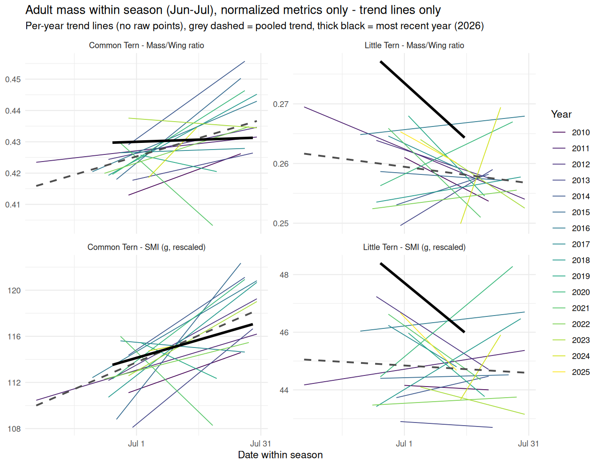

```{r setup, include=FALSE}
knitr::opts_chunk$set(echo = TRUE, warning = FALSE, message = FALSE,
                       fig.width = 9, fig.height = 7)
library(readxl)
library(dplyr)
library(lubridate)
library(tidyr)
library(ggplot2)
library(knitr)
```

# Background

This report pulls together every mass-related result from issues #5, #6,
#7, #8, #9 and #10 into one place, answering five specific questions Inbal
asked to have summarized together. **Only the two wing-normalized mass
metrics are used throughout** (simple ratio `Weight/Wing`, and SMI - scaled
mass index, Peig & Green 2009) - raw mass is not shown in any table or plot
here, even where it was the headline metric in the original issue, because
raw mass conflates body condition with body size and normalizing is the
better-supported approach (see issue #6's background for the methods
discussion). Every plot is followed by its sample-size table and its
significance-test table, and every trend section ends with a test of
whether the most recent year (2026, or the most recent year with data
where 2026 is missing) differs from what the historical trend would
predict.

**The five questions**, each becomes one section below:

1. Is there a mass difference between the breeding population and the
   passage/migrant population, and does that differ by species? (`Spring: breeders vs. migrants`)
2. Does breeding-population adult mass decline over the years in spring? (`Spring: breeder mass over years`)
3. Does adult mass change over the years in summer? (`Summer: adult mass over years`)
4. Within a season, does mass change, and is that pattern itself changing over the years or in the most recent year(s)? (`Within-season trajectory`)
5. Does chick mass decline over the years? (`Chicks: mass over years`)

# Data loading

```{r load-data}
raw_dir <- "../../data_raw"
if (!dir.exists(raw_dir)) raw_dir <- "../data_raw"
if (!dir.exists(raw_dir)) raw_dir <- "data_raw"
stopifnot(dir.exists(raw_dir))

proc_dir <- "../../data_processed"
if (!dir.exists(proc_dir)) proc_dir <- "../data_processed"
if (!dir.exists(proc_dir)) proc_dir <- "data_processed"

out_dir <- "../output"
if (!dir.exists(out_dir)) out_dir <- "output"

docs_dir <- "../docs"
if (!dir.exists(docs_dir)) docs_dir <- "docs"

ringing_path <- file.path(raw_dir, "ringing_data_raw.xlsx")
stopifnot(file.exists(ringing_path))

col_names_47 <- c(
  "CR1","RingReplace","Rec","RingPrefix","RingNum","Species","Sex","Age","Wing","Weight",
  "Date","Time","Place","Lat","Lon","Ringer","Country","Remarks","Net","CR2","Subsp","Tail","Head",
  "Breeding","CP1","CP2","CP3","CP4","Colour","D","M","OrigDate","OrigCountry","OrigLat","OrigLon","OrigAge",
  "OldCR1","OldCR2","OldCR3","OldMetal1","OldMetal2","OilHead","OilWings","OilUpperP","OilUnderP","OilLegs","OilSum"
)
raw <- read_excel(ringing_path, sheet = "Data", skip = 2, col_names = col_names_47)

juvenile_ages <- c(1, 3)
terns <- raw %>%
  filter(Species %in% c("STEALB", "STEHIR")) %>%
  mutate(
    year = year(Date),
    month = month(Date),
    date = as.Date(Date),
    ring_id = paste0(trimws(RingPrefix), RingNum),
    is_new = is.na(Rec) | trimws(Rec) == "",
    is_recap = trimws(Rec) == "R" & !is.na(Rec),
    is_capture = is_new | is_recap,
    is_adult = !(Age %in% juvenile_ages),
    species_label = ifelse(Species == "STEHIR", "Common Tern", "Little Tern")
  )
```

## Shared helper functions

```{r helpers}
format_pval <- function(p) {
  ifelse(p < 0.001, formatC(p, format = "e", digits = 2), formatC(p, format = "f", digits = 3))
}

# SMI (Peig & Green 2009): log-log SMA regression, rescale each individual's
# mass to what it would weigh at the reference wing length. `ref` lets a
# comparison between two groups share one reference point (the pooled mean
# and pooled SMA slope) instead of each group being rescaled to its own
# mean - see Section 1's note on why that distinction matters there.
compute_smi <- function(df, ref = NULL) {
  lx <- log(df$Wing)
  ly <- log(df$Weight)
  if (is.null(ref)) {
    b <- sd(ly) / sd(lx)
    wing_mean <- mean(df$Wing)
  } else {
    b <- ref$b
    wing_mean <- ref$wing_mean
  }
  df$smi <- df$Weight * (wing_mean / df$Wing) ^ b
  df$smi_b <- b
  df
}

metric_labels <- c(mass_ratio = "Mass/Wing ratio", smi = "SMI (g, rescaled)")
relabel_metric <- function(x) {
  factor(recode(x, !!!metric_labels), levels = unname(metric_labels))
}

# Tests whether the most recent year deviates from the linear year trend
# fit on individual-level records: value ~ year + is_last. The is_last
# coefficient is the last year's residual from the trend line, in the
# metric's own units, with its own p-value - answers "is the latest year
# different from what history would predict," not just "is there a trend."
last_year_deviation <- function(df, metric, label) {
  latest <- max(df$year)
  d <- df %>% mutate(is_last = factor(ifelse(year == latest, "last", "other"), levels = c("other", "last")))
  form <- as.formula(paste0(metric, " ~ year + is_last"))
  m <- lm(form, data = d)
  co <- summary(m)$coefficients
  row <- co[grepl("^is_last", rownames(co)), , drop = FALSE]
  tibble(
    label = label, metric = metric, latest_year = latest,
    n_latest = sum(d$is_last == "last"), n_other = sum(d$is_last == "other"),
    mean_latest = round(mean(d[[metric]][d$is_last == "last"]), 4),
    trend_predicted = round(predict(m, newdata = data.frame(year = latest, is_last = factor("other", levels = c("other", "last")))), 4),
    deviation = round(row[1, "Estimate"], 4),
    p_value = signif(row[1, "Pr(>|t|)"], 3)
  )
}

# Shared builder for the three "mass ~ year" trend sections (2, 3, 5):
# per-year sample size table, plot (n labelled below each point, trend
# line drawn only where significant), significance table, and a
# last-year-vs-trend deviation table. `df` must have species_label, year,
# mass_ratio, smi.
build_trend_outputs <- function(df, title) {
  panel_levels <- c("Common Tern - Mass/Wing ratio", "Common Tern - SMI (g, rescaled)",
                     "Little Tern - Mass/Wing ratio", "Little Tern - SMI (g, rescaled)")

  n_table <- df %>% count(species_label, year, name = "n") %>%
    pivot_wider(names_from = species_label, values_from = n, values_fill = 0)

  long <- df %>%
    pivot_longer(cols = c(mass_ratio, smi), names_to = "metric", values_to = "value") %>%
    mutate(metric_label = relabel_metric(metric),
           panel_label = factor(paste(species_label, metric_label, sep = " - "), levels = panel_levels))

  yearly <- long %>%
    group_by(species_label, metric, metric_label, panel_label, year) %>%
    summarise(mean_value = mean(value), n = n(), .groups = "drop")

  trend_stats <- bind_rows(lapply(c("mass_ratio", "smi"), function(met) {
    df %>%
      group_by(species_label) %>%
      group_modify(~ {
        m <- lm(as.formula(paste0(met, " ~ year")), data = .x)
        s <- summary(m)
        tibble(n = nrow(.x), n_years = n_distinct(.x$year),
               slope_per_year = round(coef(m)["year"], 4),
               se = round(s$coefficients["year", "Std. Error"], 4),
               p_value = signif(s$coefficients["year", "Pr(>|t|)"], 3),
               r_squared = round(s$r.squared, 4))
      }) %>%
      ungroup() %>%
      mutate(metric = met)
  })) %>%
    mutate(metric = relabel_metric(metric)) %>%
    arrange(species_label, metric)

  sig_combos <- trend_stats %>%
    filter(p_value < 0.05) %>%
    mutate(metric = as.character(metric)) %>%
    distinct(species_label, metric)
  long_sig <- long %>%
    mutate(metric_chr = as.character(metric_label)) %>%
    semi_join(sig_combos, by = c("species_label", "metric_chr" = "metric"))

  label_pos <- yearly %>%
    group_by(panel_label) %>%
    mutate(y_label = min(mean_value) - 0.08 * (max(mean_value) - min(mean_value))) %>%
    ungroup()

  p <- ggplot(yearly, aes(year, mean_value, color = species_label)) +
    geom_point(size = 1.8) +
    geom_line(alpha = 0.3, linewidth = 0.4) +
    geom_smooth(data = long_sig, aes(x = year, y = value), method = "lm", se = FALSE, linewidth = 0.8) +
    geom_text(data = label_pos, aes(y = y_label, label = n), size = 2.3, show.legend = FALSE) +
    facet_wrap(~panel_label, ncol = 2, scales = "free_y") +
    guides(color = "none") +
    labs(title = title,
         subtitle = "Point = per-year mean; number below each point = sample size (n); trend line shown only where the year slope is significant (p<0.05)",
         y = NULL, x = "Year") +
    theme_minimal()

  lastyear <- bind_rows(lapply(c("mass_ratio", "smi"), function(met) {
    bind_rows(lapply(c("Common Tern", "Little Tern"), function(sp) {
      last_year_deviation(df %>% filter(species_label == sp), met, sp)
    }))
  })) %>%
    mutate(metric = relabel_metric(metric)) %>%
    arrange(label, metric)

  list(n_table = n_table, plot = p, trend_stats = trend_stats, lastyear = lastyear)
}
```

# 1. Spring: breeders vs. migrants

**Question**: is there a mass difference between the breeding population
and the passage/migrant population, and does that differ by species?

**Population**: spring-caught (Mar-May) adults, split by issue #5 task
2c's "confirmed breeder" definition - a ring recorded in the colony in
June/July of **any** year counts as evidence it's a colony-associated
breeder ("Confirmed breeder"); a spring adult never once recorded in
June/July is the closest available proxy for a passage migrant ("Migrant
/ never seen breeding").

```{r spring-groups}
summer_ring_ids_anyyear <- terns %>%
  filter(month %in% 6:7) %>%
  distinct(ring_id) %>%
  pull(ring_id)

spring_adults_raw <- terns %>%
  filter(is_adult, !is.na(Weight), month %in% 3:5) %>%
  mutate(group = ifelse(ring_id %in% summer_ring_ids_anyyear, "Confirmed breeder", "Migrant / never seen breeding"))

n_before <- nrow(spring_adults_raw)
spring_adults <- spring_adults_raw %>% filter(!is.na(Wing))
n_after <- nrow(spring_adults)
cat("Spring adult records with Weight:", n_before, "- also with Wing:", n_after,
    sprintf("(%.1f%% retained)\n", 100 * n_after / n_before))
```

## Normalization: one pooled reference per species

**Important methodological choice, different from issues #6/#7/#8/#9**:
those trend-over-time analyses fit SMI's SMA slope/reference wing length
**per group**, which is right for tracking a group's own condition over
time. Here the goal is different - comparing two groups' mass **levels**
directly - so both groups are rescaled to one shared reference (pooled
SMA slope and pooled mean wing length, computed once per species across
both groups). Rescaling each group to its own mean wing length would
partly re-introduce the very body-size difference SMI is meant to remove
if the two groups differ in wing length (checked below - they do, for
Common Tern).

```{r spring-normalize}
spring_adults <- spring_adults %>%
  mutate(mass_ratio = Weight / Wing) %>%
  group_by(species_label) %>%
  group_modify(~ compute_smi(.x)) %>%
  ungroup()

kable(spring_adults %>% distinct(species_label, smi_b), digits = 3,
      caption = "Pooled SMA slope (b) used for SMI, by species (shared across both groups)")
```

**Does wing length itself differ between the two groups?** This is the
check that motivates using a pooled reference above:

```{r spring-wing-check, results = "asis"}
for (sp in c("Common Tern", "Little Tern")) {
  d <- spring_adults %>% filter(species_label == sp)
  tt <- t.test(Wing ~ group, data = d)
  cat("**", sp, "**: mean wing, confirmed breeder = ", round(tt$estimate[1], 2),
      " mm; migrant = ", round(tt$estimate[2], 2), " mm; t-test p = ", signif(tt$p.value, 3), "\n\n", sep = "")
}
```

## Sample size

```{r spring-n-table}
kable(
  spring_adults %>% count(species_label, group, name = "n"),
  caption = "Total records by species and group (Wing+Weight available)"
)

kable(
  spring_adults %>% count(species_label, year, group) %>%
    pivot_wider(names_from = group, values_from = n, values_fill = 0),
  caption = "Sample size by year, species and group"
)
```

## Plot

```{r spring-groups-plot, fig.height=9}
panel_levels_spring <- c("Common Tern - Mass/Wing ratio", "Little Tern - Mass/Wing ratio",
                          "Common Tern - SMI (g, rescaled)", "Little Tern - SMI (g, rescaled)")

spring_long <- spring_adults %>%
  pivot_longer(cols = c(mass_ratio, smi), names_to = "metric", values_to = "value") %>%
  mutate(metric_label = relabel_metric(metric),
         panel_label = factor(paste(species_label, metric_label, sep = " - "), levels = panel_levels_spring))

spring_yearly <- spring_long %>%
  group_by(species_label, group, metric, metric_label, panel_label, year) %>%
  summarise(mean_value = mean(value), n = n(), .groups = "drop")

# Two groups' n-labels at the same y position would overlap (both plotted
# "below the point"), so each group gets its own row, stacked vertically
# and colored to match its line, rather than a single shared y_label.
label_pos_spring <- spring_yearly %>%
  group_by(panel_label) %>%
  mutate(panel_range = max(mean_value) - min(mean_value),
         y_label = min(mean_value) - if_else(group == "Confirmed breeder", 0.06, 0.12) * panel_range) %>%
  ungroup()

p_spring_groups <- ggplot(spring_yearly, aes(year, mean_value, color = group)) +
  geom_point(size = 1.8) +
  geom_line(linewidth = 0.4, alpha = 0.5) +
  geom_text(data = label_pos_spring, aes(y = y_label, label = n, color = group), size = 2, show.legend = FALSE) +
  facet_wrap(~panel_label, ncol = 2, scales = "free_y") +
  labs(title = "Spring mass: confirmed breeder vs. migrant, by year",
       subtitle = "Point = per-year mean; numbers below = sample size (n) that year, colored by group",
       y = NULL, x = "Year", color = NULL) +
  theme_minimal() +
  theme(legend.position = "bottom")
p_spring_groups
```

## Significance test: does the group gap hold?

Two tests per species/metric: a pooled two-sample t-test (ignoring year),
and a year-controlled model (`value ~ group + year`, holding year fixed)
as a robustness check against the group difference being confounded by
which years each group happens to have more/less data in.

```{r spring-groups-test}
spring_group_tests <- bind_rows(lapply(c("mass_ratio", "smi"), function(met) {
  bind_rows(lapply(c("Common Tern", "Little Tern"), function(sp) {
    d <- spring_adults %>% filter(species_label == sp)
    breeder_v <- d[[met]][d$group == "Confirmed breeder"]
    migrant_v <- d[[met]][d$group == "Migrant / never seen breeding"]
    tt <- t.test(breeder_v, migrant_v)
    d2 <- d %>% mutate(year_f = factor(year))
    m <- lm(as.formula(paste0(met, " ~ group + year_f")), data = d2)
    co <- summary(m)$coefficients
    row <- co[grepl("^group", rownames(co)), , drop = FALSE]
    tibble(
      species_label = sp, metric = met,
      n_breeder = length(breeder_v), n_migrant = length(migrant_v),
      mean_breeder = round(mean(breeder_v), 4), mean_migrant = round(mean(migrant_v), 4),
      pooled_t_p = signif(tt$p.value, 3),
      year_controlled_effect = round(row[1, "Estimate"], 4),
      year_controlled_p = signif(row[1, "Pr(>|t|)"], 3)
    )
  }))
})) %>%
  mutate(metric = relabel_metric(metric)) %>%
  arrange(species_label, metric)

kable(spring_group_tests, digits = 4,
      caption = "Confirmed breeder vs. migrant: pooled t-test and year-controlled effect, by species/metric")
```

## Is the last year's gap different from the historical gap?

```{r spring-groups-lastyear}
spring_lastyear_tests <- bind_rows(lapply(c("mass_ratio", "smi"), function(met) {
  bind_rows(lapply(c("Common Tern", "Little Tern"), function(sp) {
    d <- spring_adults %>% filter(species_label == sp)
    latest <- max(d$year)
    d <- d %>% mutate(is_last = factor(ifelse(year == latest, "last", "other"), levels = c("other", "last")))
    form <- as.formula(paste0(met, " ~ group * is_last"))
    m <- lm(form, data = d)
    co <- summary(m)$coefficients
    inter_name <- grep(":is_last", rownames(co), value = TRUE)
    if (length(inter_name) == 0) {
      tibble(species_label = sp, metric = met, latest_year = latest,
             interaction_p = NA_real_, note = "insufficient data to fit interaction")
    } else {
      tibble(species_label = sp, metric = met, latest_year = latest,
             interaction_p = signif(co[inter_name, "Pr(>|t|)"], 3), note = "")
    }
  }))
})) %>%
  mutate(metric = relabel_metric(metric)) %>%
  arrange(species_label, metric)

kable(spring_lastyear_tests, digits = 4,
      caption = "Does the breeder-vs-migrant gap in the most recent year differ from the gap in other years? (group x is_last_year interaction)")
```

# 2. Spring: breeder mass over years

**Question**: does breeding-population adult mass decline over the years
in spring?

**Population**: Common Tern uses the "Confirmed breeder" group from
Section 1 (spring-caught, confirmed via a June/July sighting in any
year) - the closest available breeding-population definition. **Little
Tern has no meaningful breeder/non-breeder split** (issue #5 task 2
found no significant mass difference between the two, and Section 1
above confirms it again under normalization), so Little Tern uses **all**
spring adults, unsplit - splitting an already-small sample here would add
noise, not signal. SMI is fit **per group on its own data** here (unlike
Section 1's pooled reference), matching issues #6/#7/#8/#9's convention
for tracking a group's own condition over time.

```{r spring-trend-data}
ct_breeder_trend <- terns %>%
  filter(species_label == "Common Tern", is_adult, !is.na(Weight), !is.na(Wing), month %in% 3:5,
         ring_id %in% summer_ring_ids_anyyear) %>%
  mutate(mass_ratio = Weight / Wing) %>%
  compute_smi()

lt_adult_trend <- terns %>%
  filter(species_label == "Little Tern", is_adult, !is.na(Weight), !is.na(Wing), month %in% 3:5) %>%
  mutate(mass_ratio = Weight / Wing) %>%
  compute_smi()

spring_trend_pop <- bind_rows(ct_breeder_trend, lt_adult_trend)
res_spring_trend <- build_trend_outputs(spring_trend_pop, "Spring breeder mass over years")
```

## Sample size

```{r spring-trend-n}
kable(res_spring_trend$n_table, caption = "Sample size by year and species (Common Tern = confirmed breeders; Little Tern = all spring adults)")
```

## Plot

```{r spring-trend-plot, fig.height=8}
res_spring_trend$plot
```

## Significance test

```{r spring-trend-stats}
kable(res_spring_trend$trend_stats, digits = 4, caption = "value ~ year regression, spring breeder mass, by species/metric")
```

## Is the last year different from the historical trend?

```{r spring-trend-lastyear}
kable(res_spring_trend$lastyear %>% rename(species_label = label), digits = 4,
      caption = "Does the most recent year's mean deviate from what the linear year-trend predicts? (value ~ year + is_last_year)")
```

# 3. Summer: adult mass over years

**Question**: does adult mass change over the years in summer?

**Population**: adults captured directly in the colony during summer
(Jun-Jul, new ringings + recaptures) - by construction all breeders, so
no breeder/non-breeder split is needed (matches issue #8's population).

```{r summer-trend-data}
summer_adult_trend <- terns %>%
  filter(is_capture, !(Age %in% juvenile_ages), !is.na(Weight), !is.na(Wing), month %in% 6:7) %>%
  mutate(mass_ratio = Weight / Wing) %>%
  group_by(species_label) %>%
  group_modify(~ compute_smi(.x)) %>%
  ungroup()

res_summer_trend <- build_trend_outputs(summer_adult_trend, "Summer (Jun-Jul) adult mass over years")
```

## Sample size

```{r summer-trend-n}
kable(res_summer_trend$n_table, caption = "Sample size by year and species (summer-caught adults)")
```

## Plot

```{r summer-trend-plot, fig.height=8}
res_summer_trend$plot
```

## Significance test

```{r summer-trend-stats}
kable(res_summer_trend$trend_stats, digits = 4, caption = "value ~ year regression, summer adult mass, by species/metric")
```

## Is the last year different from the historical trend?

```{r summer-trend-lastyear}
kable(res_summer_trend$lastyear %>% rename(species_label = label), digits = 4,
      caption = "Does the most recent year's mean deviate from what the linear year-trend predicts? (value ~ year + is_last_year)")
```

# 4. Within-season trajectory

**Question**: within a season, does mass change, and is that pattern
itself changing over the years or in the most recent year(s)?

This reuses issue #10's `scripts/09_summer_adult_within_season.Rmd`
results directly (Jun-Jul window - August can include passage migrants
as well as the local breeding population, so it's excluded here),
filtered to the two normalized metrics only. Full detail, including the
raw-mass comparison and the Jun-Aug window, is in that script/issue.

```{r within-season-load}
within_pooled <- read.csv(file.path(proc_dir, "summer_adult_within_season_pooled_stats_normalized.csv")) %>%
  filter(window == "Jun-Jul", metric != "Raw mass (g)")
within_interaction <- read.csv(file.path(proc_dir, "summer_adult_within_season_interaction_stats_normalized.csv")) %>%
  filter(window == "Jun-Jul", metric != "Raw mass (g)")
within_peryear <- read.csv(file.path(proc_dir, "summer_adult_within_season_junjul_peryear_slopes.csv")) %>%
  filter(metric != "Raw mass (g)")
within_recent <- read.csv(file.path(proc_dir, "summer_adult_within_season_junjul_recent_vs_historical.csv")) %>%
  filter(metric != "Raw mass (g)")
```

## Sample size

```{r within-season-n}
kable(within_pooled %>% select(species_label, metric, n, n_years),
      caption = "Sample size, Jun-Jul within-season population, by species/metric")
```

## Plot

Same population and method as issue #10's within-season plots (per-year
trend lines colored by year, latest year excluded from that layer and
shown separately as the thick black line - see issue #10 for why),
filtered to the two normalized metrics only:



## Significance test: does mass change within the season, in general?

```{r within-season-pooled}
kable(within_pooled %>% select(-window), digits = 4,
      caption = "Pooled value ~ day_of_season, Jun-Jul, normalized metrics")
kable(within_interaction %>% select(-window),
      caption = "day_of_season x year interaction - does the within-season pattern hold every year, or vary?")
```

## Per-year within-season slope

```{r within-season-peryear}
kable(within_peryear, digits = 4,
      caption = "Per-year value ~ day_of_season slope, Jun-Jul (years with n >= 5 only)")

kable(within_peryear %>% group_by(species_label, metric) %>%
        summarise(n_years = n(), n_negative = sum(slope < 0), n_positive = sum(slope > 0), .groups = "drop"),
      caption = "Sign of the per-year slope")
```

Common Tern's within-season slope is **positive (increasing) in the
majority of years under both normalized metrics** (13 of 16), with a
**minority of years - 3 of 16 - showing a decrease**. Little Tern's is
majority-negative but close to even once normalized (10/17 ratio,
9/17 SMI) - the weaker, less consistent pattern of the two species.

## Is the last year (or last few years) different from the rest?

```{r within-season-lastyear}
kable(within_recent, digits = 4,
      caption = "Recent-years vs. historical within-season slope, Jun-Jul, normalized metrics (day_of_season x group interaction test)")
```

No significant difference for either species, under either normalized
metric, under either definition of "recent" (all p > 0.09) - see issue
#10 for the full reasoning behind this test design.

# 5. Chicks: mass over years

**Question**: does chick mass decline over the years?

**Population**: this-year juveniles (age 3), Jun-Aug, new ringings +
recaptures (matches issue #9's population).

```{r chick-trend-data}
chick_trend <- terns %>%
  filter(is_capture, Age == 3, !is.na(Weight), !is.na(Wing), month %in% 6:8) %>%
  mutate(mass_ratio = Weight / Wing) %>%
  group_by(species_label) %>%
  group_modify(~ compute_smi(.x)) %>%
  ungroup()

res_chick_trend <- build_trend_outputs(chick_trend, "Summer chick mass over years")
```

## Sample size

```{r chick-trend-n}
kable(res_chick_trend$n_table, caption = "Sample size by year and species (Jun-Aug chicks)")
```

## Plot

```{r chick-trend-plot, fig.height=8}
res_chick_trend$plot
```

## Significance test

```{r chick-trend-stats}
kable(res_chick_trend$trend_stats, digits = 4, caption = "value ~ year regression, chick mass, by species/metric")
```

## Is the last year different from the historical trend?

```{r chick-trend-lastyear}
kable(res_chick_trend$lastyear %>% rename(species_label = label), digits = 4,
      caption = "Does the most recent year's mean deviate from what the linear year-trend predicts? (value ~ year + is_last_year)")
```

Little Tern's "last year" here is **2025, not 2026** - there is zero
Little Tern chick weight data in 2026, and only n=1 in 2025 (see issue
#9's caveat) - this deviation test is not meaningful for Little Tern and
is included only for completeness.

# Save outputs

```{r save-outputs}
write.csv(spring_group_tests, file.path(proc_dir, "mass_summary_spring_breeder_vs_migrant_tests.csv"), row.names = FALSE)
write.csv(spring_lastyear_tests, file.path(proc_dir, "mass_summary_spring_breeder_vs_migrant_lastyear.csv"), row.names = FALSE)
write.csv(res_spring_trend$trend_stats, file.path(proc_dir, "mass_summary_spring_breeder_trend_stats.csv"), row.names = FALSE)
write.csv(res_spring_trend$lastyear, file.path(proc_dir, "mass_summary_spring_breeder_trend_lastyear.csv"), row.names = FALSE)
write.csv(res_summer_trend$trend_stats, file.path(proc_dir, "mass_summary_summer_adult_trend_stats.csv"), row.names = FALSE)
write.csv(res_summer_trend$lastyear, file.path(proc_dir, "mass_summary_summer_adult_trend_lastyear.csv"), row.names = FALSE)
write.csv(res_chick_trend$trend_stats, file.path(proc_dir, "mass_summary_chick_trend_stats.csv"), row.names = FALSE)
write.csv(res_chick_trend$lastyear, file.path(proc_dir, "mass_summary_chick_trend_lastyear.csv"), row.names = FALSE)
cat("Wrote 8 CSVs to", proc_dir, "with the mass_summary_ prefix\n")
```
