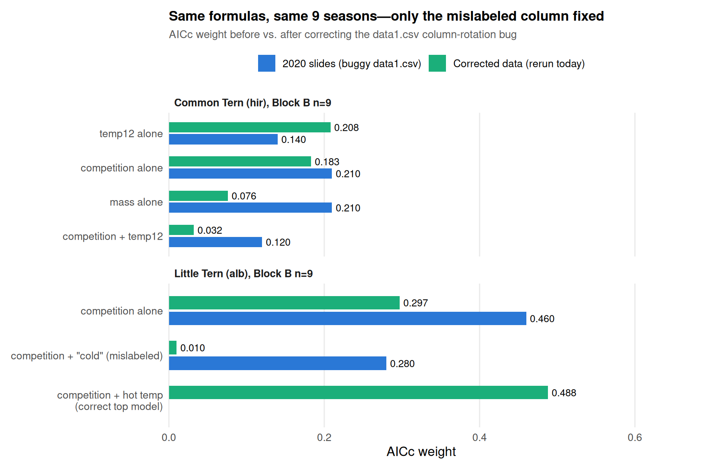
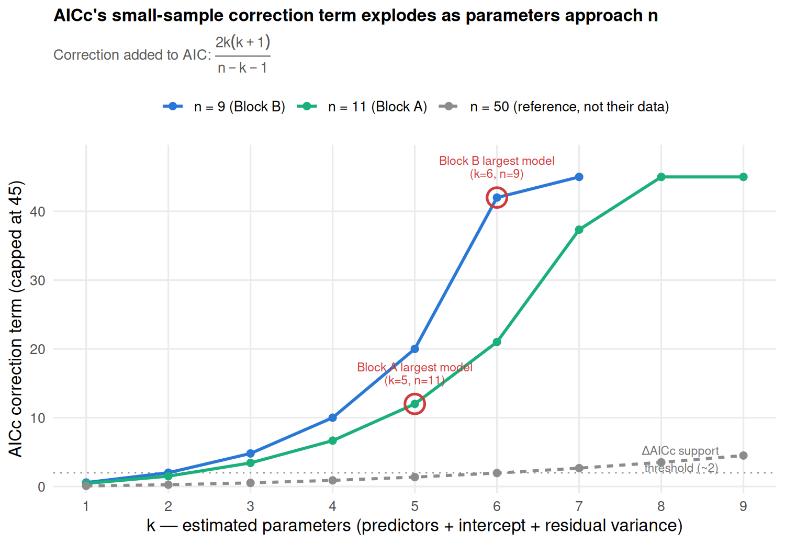

# Yosef's 2020 breeding-success analysis - what it was, what he found, what changed after the bug fix

One place with everything about this specific piece of work: what Yosef
modeled, exactly which candidate models he compared, what he originally
reported, and what changes once a data bug in his input file is corrected.
This is the starting point for choosing a better parameter set for the new
survival analysis - not the new analysis itself.

Files in this folder:
- `GLM_2020_original.R` / `plot_2020_original.R` - Yosef's original scripts, unedited (reference only, not runnable as-is - see `data_raw/README.md`)
- `01_replicate_2020_baseline.R` - reruns his exact model set on the corrected data
- `output/01_replication_results.txt` - full model-selection tables for every model below
- `02_make_instability_figures.R` - generates the two figures below from the numbers in this doc
- `output/figures/fig1_before_after_weights.png`, `output/figures/fig2_aicc_correction.png`

## 1. What the analysis was

**Question**: what predicts chick-ringing success (a season's breeding
output) for each species, at Atlit? Modeled separately for Common Tern
(`hir`, *Sterna hirundo*) and Little Tern (`alb`, *Sternula albifrons*).

**Method**: Gaussian GLMs, one per candidate predictor combination, ranked
by AICc (`MuMIn::model.sel()`). Following Yosef's own slides, a model is
in the "supported" set if it falls within **ΔAICc < 2** of the best model
- that's the threshold used throughout this document and in his original
slides.

**Two different numbers, don't conflate them**: `model.sel()`'s output
table has both a `delta` column and a `weight` column - they're not the
same thing, and only one of them has the "~2" rule of thumb.
- `delta` (ΔAICc) is each model's AICc minus the best model's AICc. The
  **<2 / 4-7 / >10** convention (Burnham & Anderson) applies to *this*
  column - that's the actual "supported set" test used throughout this doc.
- `weight` is derived from delta (∝ exp(-delta/2), normalized to sum to 1
  **across whatever candidate set you fit**) - a relative-probability
  share, not a fixed threshold. There's no equivalent "weight > 0.2 = good"
  rule: with 23-27 candidates in the set, the true best model's weight gets
  mechanically diluted just by there being more similar candidates to share
  probability with, independent of how good the data actually is. The
  weight numbers quoted below (e.g. "0.21", "0.46") are this second
  quantity - useful for ranking, not a stand-alone bar to clear.

**Two separate blocks, each with its own predictor set and time window**:

### Block A - 2010-2020 (11 years), weather + colony-wide events only

Source: `data_2010-2020_legacy.csv`. Predictors:

| Variable | Meaning |
|---|---|
| `predation` | ≥1 predation event that season (yes/no) |
| `newcastle` | Newcastle disease outbreak that season (yes/no) |
| `temp37` | days (May-Jun) with max temp > 37°C |
| `temp12` | days (May-Jun) with min temp < 12°C |
| `meanMAXtemp` | mean daily max temp, May-Jun |
| `meanMINtemp` | mean daily min temp, May-Jun |
| `rainMAY` | rainfall in May (mm) |
| `rainJUN` | rainfall in June (mm) |

**27 candidate models per species**: every combination of {none /
`predation` / `newcastle` / both} crossed with {no weather term, or
exactly one of the 6 weather variables}. E.g. `m1: hir ~ predation`,
`m7: hir ~ predation + newcastle + temp37`, `m24: hir ~ rainJUN`. Full
list of all 27 formulas is in `GLM_2020_original.R` lines 17-127 (Common
Tern) / 140-250 (Little Tern) - identical structure for both species.

### Block B - 2012-2020 (9 years), + interspecific competition + body mass

Source: `data1_2012-2020_legacy.csv` (starts 2 years later - needed for the
2-year competition lag). Predictors:

| Variable | Meaning |
|---|---|
| `predation` | same as Block A |
| `hirTWOyears` (alb model) / `albTWOyears` (hir model) | **the other species'** chick count 2 years prior - interspecific-competition proxy |
| `hirMASS` / `albMASS` | pre-breeding (spring) average body mass that year (g) - "body condition" |
| one temperature variable | **hir model**: `temp37` or `temp12`. **alb model**: `meanMAXtemp` or `meanMINtemp`. Note the two species' models use different temperature metrics here - not a typo, that's how Yosef set it up. |

**23 candidate models per species**: every subset of the 3 non-temperature
predictors (predation, competition, mass - 7 non-empty subsets) combined
with no temperature term or with one of the two temperature choices.
Full list: `GLM_2020_original.R` lines 278-368 (hir) / 386-476 (alb).

## 2. What Yosef originally reported (`סיכום 2020.pptx`, 2020)

Only Block B (the 2012-2020 competition+mass model) got a headline result
in his slides - Block A wasn't singled out as a separate conclusion.
Quoting his slides directly (slide 10 = Common Tern, slide 12 = Little
Tern), the ΔAICc < 2 confidence set:

**Common Tern (`hir`), 2012-2020 - slide 10**: four models essentially tied
- interspecific competition alone (weight 0.21)
- body condition (mass) alone (weight 0.21)
- cold temperature, `temp12` (weight 0.14)
- competition + cold temperature (weight 0.12)

**Little Tern (`alb`), 2012-2020 - slide 12**: two models
- interspecific competition alone (weight **0.46**)
- competition + "cold average temp" (weight 0.28)

This second Little Tern model is where the bug bites hardest - see below.

## 3. The bug (full mechanism: `data_raw/README.md`)

`data1_2012-2020_legacy.csv`'s temperature columns are shifted one
position, and its `predation` column was overwritten with a duplicate
temperature value instead of a real yes/no flag. Concretely, the column
labeled `meanMINtemp` in that file actually holds `meanMAXtemp`'s real
values (and vice versa - the whole 4-column block rotates by one).

So Little Tern's reported 2nd-place model, **"competition + cold average
temp,"** was actually fit on **`meanMAXtemp`** (a heat metric) under a
`meanMINtemp` label - the opposite of what was reported. And every model
anywhere in Block B that used `predation` was fit on a mislabeled
temperature value instead of a real predation flag.

## 4. Results after the fix (`01_replication_results.txt`, reran today)

Corrected data: `predation`/`newcastle`/all four temperature columns for
2012-2020 pulled from the trusted `data_2010-2020_legacy.csv` instead of
`data1.csv`; `hirMASS`/`albMASS` (untouched by the bug) kept as-is.
Everything else - years, predictors, model structure, species - identical
to Yosef's original script. **Caveat that applies to every Block B number
below: n=9, so these AICc weights are unstable at this sample size** - this
is a bug-check result, not yet a paper-ready finding, and hasn't been sent
back to Yosef.

**Block A (2010-2020, 11yr) - not affected by the bug** (its source file,
`data.csv`, was already verified correct - shown here for completeness,
Yosef never headlined a specific Block A result):

| Species | ΔAICc<2 confidence set | weight |
|---|---|---|
| hir | predation | 0.225 |
| | predation + cold days (`temp12`) | 0.176 |
| | cold days (`temp12`) | 0.116 |
| | predation + hot days (`temp37`) | 0.092 |
| alb | predation | 0.252 |
| | cold mean temp (`meanMINtemp`) | 0.117 |
| | hot mean temp (`meanMAXtemp`) | 0.096 |

**Block B (2012-2020, 9yr) - directly comparable to slides 10 & 12 above:**

| Species | Before (2020 slides, buggy data) | After (corrected data) |
|---|---|---|
| **hir** | competition 0.21 / mass 0.21 / `temp12` 0.14 / competition+`temp12` 0.12 | `temp12` **0.208** / predation **0.202** / competition **0.183** / competition+hot days(`temp37`) **0.125** - still an even 4-way split, order shuffles but no single model dominates either way |
| **alb** | competition alone **0.46** / competition + "cold temp" **0.28** | competition + hot mean temp(`meanMAXtemp`) **0.488** / competition alone **0.297** - top model **flips**: from "competition alone" to "competition + heat," and it's now more dominant (0.49 vs. the original 0.46), not less |

**Bottom line**: the previously-reported Little Tern 2nd-place model
("competition + cold temp") doesn't survive the fix at all - it was an
artifact of the mislabeled column. The corrected 2nd-place model for
Little Tern is competition alone, now at 0.297 (close to its original
weight, just no longer top). Common Tern's result was already an even
split across 4 models and stays that way, just with `predation` correctly
represented instead of silently duplicating a temperature value.

## 5. Why the fix moved things this much: n=9-11 is very close to the edge

This isn't just "bugs happen, always fix them" - the *size* of the swing
above (e.g. Little Tern's 2nd model: weight 0.28 -> 0.01) is exactly what
you'd expect from comparing ~9-27 candidate models against 9-11 rows, bug
or no bug. Two compounding reasons, in order of how much they matter here:

**1. Degrees of freedom.** A Gaussian GLM with `k` parameters costs the
intercept, every predictor coefficient, *and* the residual variance -
e.g. `hir ~ predation + newcastle + temp37` (3 predictor terms) is `k=5`.
With n=11 (Block A) that leaves 6 residual df; with n=9 (Block B) a 4-term
model (`k=6`) leaves 2. The standard heuristic - roughly **10 observations
per estimated parameter** for stable OLS/GLM estimates - is violated by
every model bigger than k=1 in this analysis.

**2. AICc's own small-sample correction explodes at this n.** Plain AIC
under-penalizes complexity when n isn't large relative to k, so AICc (what
`model.sel()` actually computes) adds a correction term:

&nbsp;&nbsp;&nbsp;&nbsp;`AICc = AIC + 2k(k+1) / (n-k-1)`

This is small when n≫k - but `n-k-1` sits in the denominator, so as `k`
approaches `n` the term doesn't grow, it **explodes**, and it's undefined
once `k ≥ n-1`. Concretely, at n=11 the correction is already **12** for
the largest Block A model (k=5) - bigger than the ΔAICc<2 threshold the
whole comparison hinges on. At n=9, the largest Block B model (k=6) pays
**42**. The same model size at a more typical ecological sample (n=50)
would pay under 2. In other words: at this n, the "penalty for complexity"
term isn't a small correction to the model's actual fit - it *dominates*
the score, which is exactly why which model "wins" swings so hard on a
single relabeled column.

**Implication for the new analysis**: capping candidate models at 3-4 terms
(as Yosef did) was the right instinct given the data, but doesn't fully
solve the problem - comparing a large candidate *set* (23-27 models) against
9-11 rows is still aggressive relative to n, which is visible in how flat
the weight distributions are even in the "before" numbers. Worth discussing
before choosing the new analysis's model set: fewer, pre-specified
candidates; reporting one model's effects with CIs instead of a ranked
"winner"; and/or using the individual-level ringing data
(`ringing_data_raw.xlsx`, 66,414 records) to get an n that isn't capped at
one row per season.
